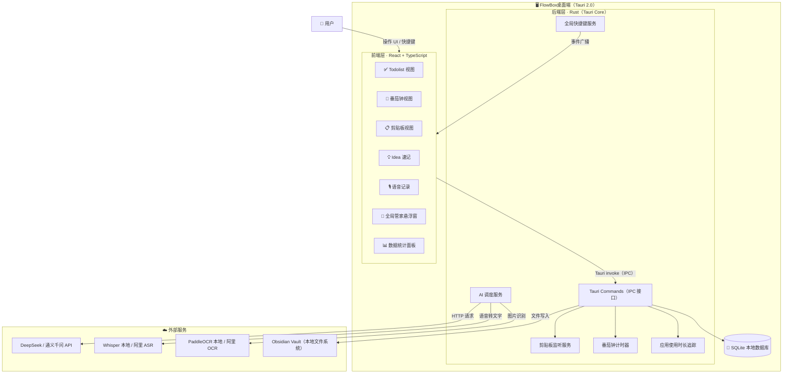
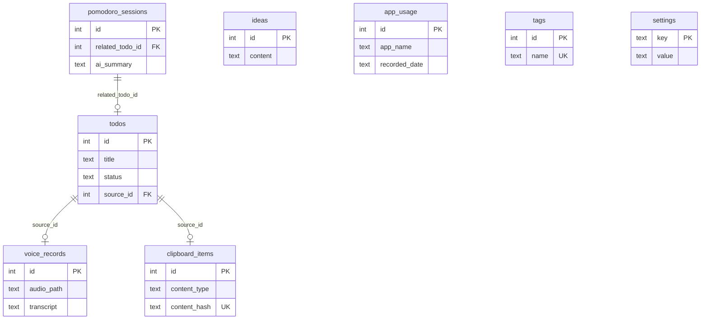
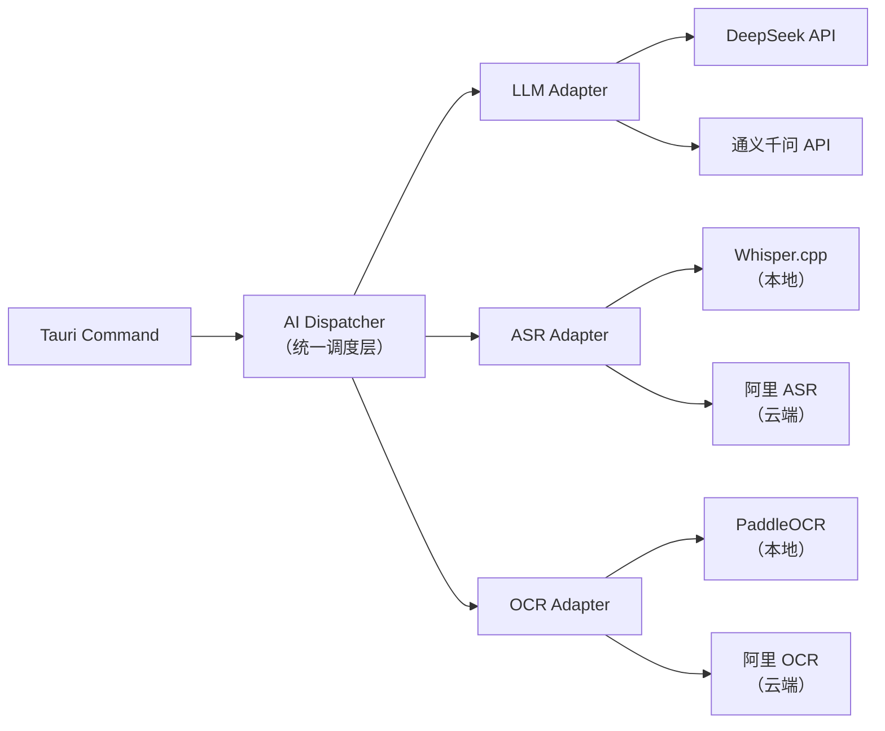
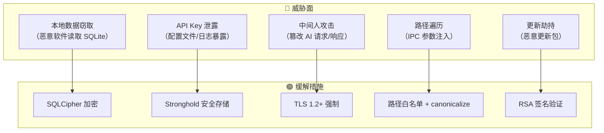

# 🧰 FlowBox桌面端 — 系统架构文档

> 项目代号：FlowBox | 产品名：FlowBox桌面端

---

## 目录

- [阶段一：需求分析与高层架构](#阶段一需求分析与高层架构)
  - [1.1 用户角色与关键用例](#11-用户角色与关键用例)
  - [1.2 系统上下文图](#12-系统上下文图)
  - [1.3 技术选型](#13-技术选型)
  - [1.4 核心模块清单](#14-核心模块清单)
- [阶段二：数据模型设计](#阶段二数据模型设计)
  - [2.1 核心数据表](#21-核心数据表)
  - [2.2 表关联关系](#22-表关联关系)
  - [2.3 索引设计](#23-索引设计)
- [阶段三：API / IPC 契约定义](#阶段三api--ipc-契约定义)
  - [3.1 Tauri Command 契约](#31-tauri-command-契约)
  - [3.2 统一响应与错误码](#32-统一响应与错误码)
  - [3.3 外部 API 调用规范](#33-外部-api-调用规范)
- [阶段四：非功能需求](#阶段四非功能需求)
  - [4.1 安全性](#41-安全性)
  - [4.2 性能](#42-性能)
  - [4.3 可观测性](#43-可观测性)
  - [4.4 打包与分发](#44-打包与分发)

---

## 阶段一：需求分析与高层架构

### 1.1 用户角色与关键用例

#### 用户角色

| 角色 | 描述 | 典型场景 |
|------|------|----------|
| **独立开发者** | 日常写代码、调试、学习，需要管理碎片信息 | 复制报错截图→AI 秒出方案；代码片段归档 |
| **内容创作者** | 写公众号、做视频、记录灵感 | 语音速记→AI 拆出选题；Idea 碰撞出新方向 |
| **职场效率控** | 会议多、任务杂、需要量化时间 | 语音→会议纪要；番茄钟专注；AI 生成日报 |

#### 关键用例

**UC-1 语音智能记录**
- 用户按快捷键开始录音 → 录音结束后自动转文字
- AI 从文字中提取：待办事项、核心观点、会议纪要
- 提取的 Todo 自动写入待办列表，打上时间和来源标签

**UC-2 剪贴板智能管家**
- 后台监听剪贴板变化，自动保存文本/图片/代码片段
- 图片自动 OCR，内容按类型打标签（`#代码` `#设计` `#文档`）
- 复制报错代码 → 弹出「AI 修复」；复制英文 → 悬浮翻译；复制长文 → 一键摘要

**UC-3 专注与时间管理**
- 番茄钟计时 + 专注时长统计，可视化趋势图
- 开启番茄钟 → 自动触发 macOS 勿扰模式
- 结束时 AI 生成「本次专注小结」；一天结束生成日报/周报

**UC-4 全局智能管家**
- `Option + Space` 唤出极简对话框
- 拖入文本/代码 → 解释、翻译、润色
- 自定义 Prompt 模板绑定快捷键（如 `Cmd+Shift+R` 润色选中文本）

**UC-5 灵感与知识管理**
- 快捷键一键弹窗记录 Idea，零摩擦
- AI 每周聚类分析零散 Idea，推送「灵感周报」
- 语音/剪贴板/Idea 按主题自动归档到 Obsidian，AI 打双链

**UC-6 截图 AI 分析**
- 全局截图快捷键 → 自动 OCR + AI 分析
- 截 UI 稿 → 生成前端代码骨架；截报错 → 给解决方案；截表格 → 转 Markdown

---

### 1.2 系统上下文图

> FlowBox是一个**纯本地桌面应用**，核心数据存储在本地 SQLite，仅在调用 AI 能力时与外部云端 API 通信。



#### 架构决策说明

| 决策 | 选择 | 理由 |
|------|------|------|
| 前后端通信 | **Tauri IPC**（非 HTTP） | 桌面应用无需 Web Server，IPC 性能更高、更安全 |
| 数据存储 | **本地 SQLite** | 隐私优先，离线可用，无需部署数据库服务 |
| AI 调用模式 | **按需远程调用** | 本地大模型对普通电脑负担大，云端 API 更稳定 |
| OCR / ASR | **本地优先 + 云端备选** | 隐私敏感场景走本地，速度要求高时走云端 |

---

### 1.3 技术选型

#### 桌面框架层

| 技术 | 版本 | 选型理由 | 备选方案 |
|------|------|----------|----------|
| **Tauri 2.0** | 2.x | 打包仅 ~5MB，原生性能，Rust 后端安全可靠 | Electron（包体 ~150MB，内存占用高） |
| **React** | 19.x | 生态成熟，组件化开发效率高，团队已有经验 | Vue 3（同样可行，但切换有学习成本） |
| **TypeScript** | 5.x | 类型安全，减少运行时错误，IDE 智能提示 | JavaScript（缺乏类型检查） |
| **Vite** | 6.x | 极速 HMR，Tauri 官方推荐的前端构建工具 | Webpack（配置复杂，启动慢） |

#### UI 与样式

| 技术 | 选型理由 |
|------|----------|
| **TailwindCSS 4** | 原子化 CSS，快速搭建 UI，暗色模式开箱支持 |
| **Shadcn/ui** | 无侵入式组件库，可复制源码深度定制 |
| **Framer Motion** | React 动画库，实现丝滑微交互 |
| **Recharts** | 基于 React 的图表库，用于专注统计和时间可视化 |

#### 数据与状态

| 技术 | 选型理由 |
|------|----------|
| **SQLite**（via `tauri-plugin-sql`） | 嵌入式数据库，零配置，离线可用，数据隐私有保障 |
| **Zustand** | 轻量状态管理，API 简洁，无 boilerplate |
| **TanStack Query** | 异步数据缓存与同步，管理 IPC 请求状态 |

#### AI 能力层

| 能力 | 首选方案 | 备选方案 | 切换条件 |
|------|----------|----------|----------|
| **LLM 推理** | DeepSeek API | 通义千问 API | 按成本/速度灵活切换 |
| **语音转文字** | Whisper.cpp（本地） | 阿里 ASR（云端） | 隐私优先选本地，长音频选云端 |
| **OCR 识别** | PaddleOCR（本地） | 阿里 OCR（云端） | 中文场景本地精度已足够 |

#### 系统集成

| 能力 | 实现方式 |
|------|----------|
| **全局快捷键** | `tauri-plugin-global-shortcut` |
| **剪贴板监听** | `tauri-plugin-clipboard-manager` |
| **系统通知** | `tauri-plugin-notification` |
| **文件系统** | `tauri-plugin-fs`（读写 Obsidian Vault） |
| **macOS 勿扰** | Rust 调用 `osascript` / AppleScript |
| **应用追踪** | Rust 调用 `NSWorkspace` API（macOS） |

#### 开发工具链

| 工具 | 用途 |
|------|------|
| **pnpm** | 包管理器，节省磁盘、安装快 |
| **ESLint + Prettier** | 代码规范与格式化 |
| **Vitest** | 前端单元测试 |
| **Cargo Test** | Rust 后端单元测试 |

---

### 1.4 核心模块清单


#### 前端模块（React）

| 模块 ID | 名称 | 职责 | 优先级 |
|---------|------|------|--------|
| `mod-todo` | 待办管理 | Todo CRUD、优先级、标签筛选、已完成归档 | P0 |
| `mod-idea` | Idea 速记 | 快捷键弹窗、富文本输入、标签分类 | P0 |
| `mod-pomodoro` | 番茄钟 | 计时 UI、专注/休息切换、历史记录 | P0 |
| `mod-clipboard` | 剪贴板视图 | 历史列表、搜索、分类筛选、AI 操作按钮 | P1 |
| `mod-voice` | 语音记录 | 录音控制、转写结果展示、AI 提取结果确认 | P1 |
| `mod-stats` | 数据统计 | 专注趋势图、应用时长饼图、效率成长曲线 | P1 |
| `mod-butler` | 全局管家 | 悬浮窗对话框、Prompt 模板管理、快捷指令 | P2 |
| `mod-settings` | 设置中心 | API Key 配置、快捷键自定义、主题切换 | P0 |

#### Rust 后端模块

| 模块 ID | 名称 | 职责 | 优先级 |
|---------|------|------|--------|
| `svc-database` | 数据库服务 | SQLite 连接管理、迁移、CRUD 封装 | P0 |
| `svc-clipboard` | 剪贴板监听 | 后台轮询/事件监听、内容去重、存储触发 | P1 |
| `svc-shortcut` | 快捷键管理 | 注册/注销全局快捷键、事件分发到前端 | P0 |
| `svc-timer` | 计时器引擎 | 精确计时、状态机（专注/休息/暂停）、事件回调 | P0 |
| `svc-app-tracker` | 应用追踪 | 读取前台应用信息、按分钟粒度记录使用时长 | P1 |
| `svc-notify` | 通知服务 | 系统通知推送、macOS 勿扰模式控制 | P1 |
| `svc-filesystem` | 文件系统 | 读写 Obsidian Vault、剪贴板图片本地存储 | P2 |

#### AI 服务模块

| 模块 ID | 名称 | 职责 | 优先级 |
|---------|------|------|--------|
| `ai-llm` | 大模型调度 | 统一 LLM 调用接口、Prompt 管理、流式响应 | P1 |
| `ai-asr` | 语音转文字 | Whisper.cpp 本地推理 / 云端 ASR 切换 | P1 |
| `ai-ocr` | 图片文字识别 | PaddleOCR 本地推理 / 云端 OCR 切换 | P2 |

#### 模块依赖关系

| 依赖方 | 被依赖方 | 说明 |
|--------|----------|------|
| 所有前端模块 | `svc-database` | 数据持久化 |
| `mod-voice` | `ai-asr` → `ai-llm` | 录音→转写→AI 提取 |
| `mod-clipboard` | `svc-clipboard` → `ai-ocr` → `ai-llm` | 监听→OCR→智能分类 |
| `mod-pomodoro` | `svc-timer` → `svc-notify` | 计时→通知→勿扰 |
| `mod-butler` | `ai-llm` | 对话/润色/翻译 |
| `mod-stats` | `svc-app-tracker` → `svc-database` | 追踪→存储→可视化 |

---

## 阶段二：数据模型设计

> 所有表使用 SQLite，主键统一为自增 `INTEGER`，时间字段统一存 ISO 8601 字符串。

### 2.1 核心数据表

#### 表 1：`todos` — 待办事项

| 字段名 | 类型 | 必填 | 默认值 | 说明 |
|--------|------|------|--------|------|
| `id` | INTEGER | ✅ | 自增 | 主键 |
| `title` | TEXT | ✅ | — | 待办标题 |
| `content` | TEXT | ❌ | `''` | 详细描述 |
| `priority` | INTEGER | ✅ | `0` | 优先级：0=无, 1=低, 2=中, 3=高 |
| `status` | TEXT | ✅ | `'pending'` | 状态：pending / in_progress / done |
| `source` | TEXT | ❌ | `'manual'` | 来源：manual / voice / clipboard |
| `source_id` | INTEGER | ❌ | `NULL` | 关联来源记录 ID |
| `due_date` | TEXT | ❌ | `NULL` | 截止日期 |
| `tags` | TEXT | ❌ | `'[]'` | JSON 数组，标签列表 |
| `created_at` | TEXT | ✅ | `CURRENT_TIMESTAMP` | 创建时间 |
| `updated_at` | TEXT | ✅ | `CURRENT_TIMESTAMP` | 更新时间 |
| `completed_at` | TEXT | ❌ | `NULL` | 完成时间 |

#### 表 2：`ideas` — 灵感速记

| 字段名 | 类型 | 必填 | 默认值 | 说明 |
|--------|------|------|--------|------|
| `id` | INTEGER | ✅ | 自增 | 主键 |
| `content` | TEXT | ✅ | — | 灵感内容 |
| `tags` | TEXT | ❌ | `'[]'` | JSON 数组 |
| `source` | TEXT | ❌ | `'manual'` | 来源：manual / voice / clipboard |
| `is_archived` | INTEGER | ✅ | `0` | 是否归档（0/1） |
| `created_at` | TEXT | ✅ | `CURRENT_TIMESTAMP` | 创建时间 |

#### 表 3：`pomodoro_sessions` — 番茄钟记录

| 字段名 | 类型 | 必填 | 默认值 | 说明 |
|--------|------|------|--------|------|
| `id` | INTEGER | ✅ | 自增 | 主键 |
| `type` | TEXT | ✅ | `'focus'` | 类型：focus / short_break / long_break |
| `duration_minutes` | INTEGER | ✅ | `25` | 计划时长（分钟） |
| `actual_minutes` | INTEGER | ❌ | `NULL` | 实际时长 |
| `status` | TEXT | ✅ | `'completed'` | 状态：completed / interrupted |
| `related_todo_id` | INTEGER | ❌ | `NULL` | 关联的待办 ID |
| `ai_summary` | TEXT | ❌ | `NULL` | AI 生成的专注小结 |
| `started_at` | TEXT | ✅ | — | 开始时间 |
| `ended_at` | TEXT | ❌ | `NULL` | 结束时间 |

#### 表 4：`clipboard_items` — 剪贴板历史

| 字段名 | 类型 | 必填 | 默认值 | 说明 |
|--------|------|------|--------|------|
| `id` | INTEGER | ✅ | 自增 | 主键 |
| `content_type` | TEXT | ✅ | — | 类型：text / image / code |
| `text_content` | TEXT | ❌ | `NULL` | 文本内容 |
| `image_path` | TEXT | ❌ | `NULL` | 图片本地存储路径 |
| `ocr_text` | TEXT | ❌ | `NULL` | OCR 识别结果 |
| `category` | TEXT | ❌ | `NULL` | AI 分类：代码 / 设计 / 文档 / 发票 |
| `tags` | TEXT | ❌ | `'[]'` | JSON 数组 |
| `is_pinned` | INTEGER | ✅ | `0` | 是否置顶 |
| `content_hash` | TEXT | ✅ | — | 内容哈希，用于去重 |
| `created_at` | TEXT | ✅ | `CURRENT_TIMESTAMP` | 采集时间 |

#### 表 5：`voice_records` — 语音记录

| 字段名 | 类型 | 必填 | 默认值 | 说明 |
|--------|------|------|--------|------|
| `id` | INTEGER | ✅ | 自增 | 主键 |
| `audio_path` | TEXT | ✅ | — | 音频文件本地路径 |
| `duration_seconds` | INTEGER | ✅ | — | 音频时长（秒） |
| `transcript` | TEXT | ❌ | `NULL` | ASR 转写文本 |
| `ai_summary` | TEXT | ❌ | `NULL` | AI 生成的摘要 |
| `ai_todos` | TEXT | ❌ | `NULL` | AI 提取的待办（JSON 数组） |
| `status` | TEXT | ✅ | `'recording'` | 状态：recording / transcribing / done |
| `created_at` | TEXT | ✅ | `CURRENT_TIMESTAMP` | 录制时间 |

#### 表 6：`app_usage` — 应用使用时长

| 字段名 | 类型 | 必填 | 默认值 | 说明 |
|--------|------|------|--------|------|
| `id` | INTEGER | ✅ | 自增 | 主键 |
| `app_name` | TEXT | ✅ | — | 应用名称 |
| `app_bundle_id` | TEXT | ❌ | `NULL` | macOS Bundle ID |
| `window_title` | TEXT | ❌ | `NULL` | 窗口标题 |
| `duration_seconds` | INTEGER | ✅ | — | 使用时长（秒） |
| `recorded_date` | TEXT | ✅ | — | 记录日期（YYYY-MM-DD） |
| `hour` | INTEGER | ✅ | — | 小时段（0-23） |

#### 表 7：`tags` — 标签表

| 字段名 | 类型 | 必填 | 默认值 | 说明 |
|--------|------|------|--------|------|
| `id` | INTEGER | ✅ | 自增 | 主键 |
| `name` | TEXT | ✅ | — | 标签名（唯一） |
| `color` | TEXT | ❌ | `'#6366f1'` | 标签颜色 |
| `created_at` | TEXT | ✅ | `CURRENT_TIMESTAMP` | 创建时间 |

#### 表 8：`settings` — 用户设置

| 字段名 | 类型 | 必填 | 默认值 | 说明 |
|--------|------|------|--------|------|
| `key` | TEXT | ✅ | — | 设置键（主键） |
| `value` | TEXT | ✅ | — | 设置值（JSON 序列化） |
| `updated_at` | TEXT | ✅ | `CURRENT_TIMESTAMP` | 更新时间 |

---

### 2.2 表关联关系



#### 关系说明

| 关系 | 类型 | 说明 |
|------|------|------|
| `todos.source_id` → `voice_records.id` | 一对多 | 一条语音可提取多个待办 |
| `todos.source_id` → `clipboard_items.id` | 一对多 | 一条剪贴板可生成多个待办 |
| `pomodoro_sessions.related_todo_id` → `todos.id` | 多对一 | 多个番茄钟可关联同一个待办 |
| `todos.tags` / `ideas.tags` / `clipboard_items.tags` | JSON 数组 | 通过 `tags.name` 关联，非外键（SQLite 轻量设计） |

> **设计决策**：标签采用 JSON 数组内嵌而非中间表，原因是 SQLite 单机场景下查询简单、避免多表 JOIN 性能开销。`tags` 表仅用于标签元数据管理（颜色、去重）。

---

### 2.3 索引设计

| 表 | 索引名 | 字段 | 类型 | 理由 |
|----|--------|------|------|------|
| `todos` | `idx_todos_status` | `status` | 普通 | 按状态筛选（待办/进行中/已完成） |
| `todos` | `idx_todos_priority` | `priority, status` | 联合 | 按优先级排序 + 状态筛选 |
| `todos` | `idx_todos_created` | `created_at` | 普通 | 按时间排序 |
| `ideas` | `idx_ideas_created` | `created_at` | 普通 | 时间线展示 |
| `pomodoro_sessions` | `idx_pomo_started` | `started_at` | 普通 | 按日期查询专注记录 |
| `pomodoro_sessions` | `idx_pomo_todo` | `related_todo_id` | 普通 | 查询某待办的专注记录 |
| `clipboard_items` | `idx_clip_hash` | `content_hash` | 唯一 | 去重校验 |
| `clipboard_items` | `idx_clip_type_created` | `content_type, created_at` | 联合 | 按类型筛选 + 时间排序 |
| `app_usage` | `idx_usage_date_hour` | `recorded_date, hour` | 联合 | 按日期+时段聚合查询 |
| `app_usage` | `idx_usage_app_date` | `app_name, recorded_date` | 联合 | 按应用+日期统计时长 |
| `tags` | `idx_tags_name` | `name` | 唯一 | 标签名去重 |

---

## 阶段三：API / IPC 契约定义

> 所有前后端通信通过 Tauri IPC（`invoke`）完成，不使用 HTTP。命令名采用 `模块_动作` 格式，参数和返回值均为 JSON 序列化的 Rust struct。

### 3.1 Tauri Command 契约

#### 📌 通用约定

- **命名规范**：`snake_case`，格式为 `{module}_{action}`，如 `todo_create`
- **参数传递**：前端通过 `invoke('command_name', { payload })` 调用
- **返回值**：统一包裹在 `ApiResponse<T>` 中（见 3.2 节）
- **错误处理**：Rust 端使用 `Result<T, AppError>`，自动映射为前端可读的错误码

---

#### 模块 1：待办管理（`todo_*`）

| 命令名 | 参数 | 返回值 | 说明 |
|--------|------|--------|------|
| `todo_create` | `CreateTodoPayload` | `Todo` | 创建待办 |
| `todo_update` | `UpdateTodoPayload` | `Todo` | 更新待办（标题/内容/优先级/状态） |
| `todo_delete` | `{ id: number }` | `void` | 删除待办 |
| `todo_list` | `TodoListQuery` | `Todo[]` | 查询待办列表（支持筛选/分页） |
| `todo_get` | `{ id: number }` | `Todo` | 获取单条待办详情 |
| `todo_batch_update_status` | `{ ids: number[], status: string }` | `void` | 批量更新状态 |

```typescript
// 前端类型定义

interface CreateTodoPayload {
  title: string;
  content?: string;
  priority?: 0 | 1 | 2 | 3;         // 无/低/中/高
  due_date?: string;                  // ISO 8601
  tags?: string[];
  source?: 'manual' | 'voice' | 'clipboard';
  source_id?: number;
}

interface TodoListQuery {
  status?: 'pending' | 'in_progress' | 'done';
  priority?: number;
  keyword?: string;                   // 模糊搜索 title/content
  offset?: number;                    // 默认 0
  limit?: number;                     // 默认 50
}
```

---

#### 模块 2：Idea 速记（`idea_*`）

| 命令名 | 参数 | 返回值 | 说明 |
|--------|------|--------|------|
| `idea_create` | `{ content: string, tags?: string[] }` | `Idea` | 创建灵感 |
| `idea_update` | `{ id: number, content?: string, tags?: string[] }` | `Idea` | 更新灵感 |
| `idea_delete` | `{ id: number }` | `void` | 删除灵感 |
| `idea_list` | `{ keyword?: string, is_archived?: boolean, offset?: number, limit?: number }` | `Idea[]` | 查询灵感列表 |
| `idea_archive` | `{ id: number, is_archived: boolean }` | `void` | 归档/取消归档 |

---

#### 模块 3：番茄钟（`pomodoro_*`）

| 命令名 | 参数 | 返回值 | 说明 |
|--------|------|--------|------|
| `pomodoro_start` | `StartPomodoroPayload` | `PomodoroSession` | 开始一个番茄钟 |
| `pomodoro_pause` | `void` | `PomodoroState` | 暂停当前计时 |
| `pomodoro_resume` | `void` | `PomodoroState` | 恢复计时 |
| `pomodoro_stop` | `{ interrupted: boolean }` | `PomodoroSession` | 结束番茄钟 |
| `pomodoro_get_state` | `void` | `PomodoroState` | 获取当前计时状态（前端轮询/事件补偿） |
| `pomodoro_list_sessions` | `{ date_from?: string, date_to?: string, limit?: number }` | `PomodoroSession[]` | 查询历史记录 |
| `pomodoro_stats` | `{ date_from: string, date_to: string }` | `PomodoroStats` | 专注统计聚合 |

```typescript
interface StartPomodoroPayload {
  type: 'focus' | 'short_break' | 'long_break';
  duration_minutes: number;           // 默认 25/5/15
  related_todo_id?: number;
}

interface PomodoroState {
  is_running: boolean;
  type: 'focus' | 'short_break' | 'long_break';
  elapsed_seconds: number;
  total_seconds: number;
  related_todo_id?: number;
}

interface PomodoroStats {
  total_focus_minutes: number;
  session_count: number;
  completed_count: number;
  interrupted_count: number;
  daily_breakdown: { date: string; minutes: number }[];
}
```

---

#### 模块 4：剪贴板（`clipboard_*`）

| 命令名 | 参数 | 返回值 | 说明 |
|--------|------|--------|------|
| `clipboard_start_watching` | `void` | `void` | 启动后台剪贴板监听 |
| `clipboard_stop_watching` | `void` | `void` | 停止监听 |
| `clipboard_list` | `ClipboardListQuery` | `ClipboardItem[]` | 查询历史列表 |
| `clipboard_get` | `{ id: number }` | `ClipboardItem` | 获取单条详情 |
| `clipboard_delete` | `{ id: number }` | `void` | 删除记录 |
| `clipboard_pin` | `{ id: number, is_pinned: boolean }` | `void` | 置顶/取消置顶 |
| `clipboard_clear_history` | `{ before_date?: string }` | `number` | 清除历史，返回删除条数 |

```typescript
interface ClipboardListQuery {
  content_type?: 'text' | 'image' | 'code';
  category?: string;
  keyword?: string;                   // 搜索 text_content + ocr_text
  is_pinned?: boolean;
  offset?: number;
  limit?: number;
}
```

---

#### 模块 5：语音记录（`voice_*`）

| 命令名 | 参数 | 返回值 | 说明 |
|--------|------|--------|------|
| `voice_start_recording` | `void` | `{ record_id: number }` | 开始录音，返回记录 ID |
| `voice_stop_recording` | `{ record_id: number }` | `VoiceRecord` | 停止录音，保存音频文件 |
| `voice_transcribe` | `{ record_id: number }` | `VoiceRecord` | 触发 ASR 转写 |
| `voice_ai_extract` | `{ record_id: number }` | `VoiceAiResult` | AI 提取待办/摘要 |
| `voice_list` | `{ offset?: number, limit?: number }` | `VoiceRecord[]` | 查询列表 |
| `voice_delete` | `{ record_id: number }` | `void` | 删除记录及音频文件 |

```typescript
interface VoiceAiResult {
  summary: string;                    // AI 摘要
  todos: { title: string; priority: number }[];   // 提取的待办
  key_points: string[];               // 核心观点
}
```

---

#### 模块 6：系统服务（`app_*` / `settings_*` / `tag_*`）

| 命令名 | 参数 | 返回值 | 说明 |
|--------|------|--------|------|
| `app_usage_list` | `{ date: string }` | `AppUsage[]` | 查询某日应用使用记录 |
| `app_usage_stats` | `{ date_from: string, date_to: string }` | `AppUsageStats` | 应用时长统计 |
| `app_tracker_start` | `void` | `void` | 启动应用追踪 |
| `app_tracker_stop` | `void` | `void` | 停止追踪 |
| `settings_get` | `{ key: string }` | `string \| null` | 读取设置 |
| `settings_set` | `{ key: string, value: string }` | `void` | 写入设置 |
| `settings_get_all` | `void` | `Record<string, string>` | 读取所有设置 |
| `tag_list` | `void` | `Tag[]` | 获取所有标签 |
| `tag_create` | `{ name: string, color?: string }` | `Tag` | 创建标签 |
| `tag_delete` | `{ id: number }` | `void` | 删除标签 |

```typescript
interface AppUsageStats {
  total_hours: number;
  by_app: { app_name: string; hours: number; percentage: number }[];
  by_hour: { hour: number; minutes: number }[];     // 24 小时分布
}
```

---

#### AI 服务命令（`ai_*`）

| 命令名 | 参数 | 返回值 | 说明 |
|--------|------|--------|------|
| `ai_chat` | `AiChatPayload` | `string` | 通用 AI 对话（全局管家） |
| `ai_chat_stream` | `AiChatPayload` | 事件流 | 流式对话，通过 Tauri Event 推送 |
| `ai_summarize` | `{ text: string }` | `string` | 文本摘要 |
| `ai_translate` | `{ text: string, target_lang: string }` | `string` | 翻译 |
| `ai_polish` | `{ text: string, style?: string }` | `string` | 文本润色 |
| `ai_fix_code` | `{ code: string, language?: string, error?: string }` | `AiCodeFixResult` | 代码修复 |
| `ai_ocr` | `{ image_path: string }` | `string` | 图片 OCR 识别 |
| `ai_generate_report` | `{ type: 'daily' \| 'weekly', date: string }` | `string` | 生成日报/周报 |

```typescript
interface AiChatPayload {
  message: string;
  context?: string;                   // 附加上下文（选中文本/代码等）
  template_id?: string;               // Prompt 模板 ID
  stream?: boolean;                   // 是否流式
}

interface AiCodeFixResult {
  fixed_code: string;
  explanation: string;
  diff: string;                       // unified diff 格式
}
```

#### Tauri Event（后端 → 前端推送）

> 以下事件由 Rust 后端主动 `emit`，前端通过 `listen` 订阅。

| 事件名 | Payload | 触发时机 |
|--------|---------|----------|
| `clipboard://changed` | `ClipboardItem` | 监测到剪贴板内容变化 |
| `pomodoro://tick` | `PomodoroState` | 每秒推送计时状态 |
| `pomodoro://completed` | `PomodoroSession` | 番茄钟自然结束 |
| `ai://stream-chunk` | `{ request_id: string, chunk: string, done: boolean }` | AI 流式响应片段 |
| `voice://recording-level` | `{ level: number }` | 录音音量电平（UI 波形） |
| `voice://transcribe-progress` | `{ record_id: number, progress: number }` | 转写进度 |
| `shortcut://triggered` | `{ shortcut: string, action: string }` | 全局快捷键被触发 |
| `app-tracker://switched` | `{ app_name: string, window_title: string }` | 前台应用切换 |

---

### 3.2 统一响应与错误码

#### 响应包装结构

所有 Tauri Command 的返回值统一封装在 `ApiResponse<T>` 中：

```rust
// Rust 端定义
#[derive(Serialize)]
pub struct ApiResponse<T: Serialize> {
    pub success: bool,
    pub data: Option<T>,
    pub error: Option<AppError>,
}

#[derive(Serialize, Clone)]
pub struct AppError {
    pub code: String,         // 错误码，如 "TODO_NOT_FOUND"
    pub message: String,      // 人类可读的错误信息
    pub details: Option<String>,  // 可选的调试详情（仅 dev 模式）
}
```

```typescript
// 前端类型定义
interface ApiResponse<T> {
  success: boolean;
  data?: T;
  error?: {
    code: string;
    message: string;
    details?: string;
  };
}

// 封装的 invoke 工具函数
async function invokeCommand<T>(cmd: string, args?: Record<string, unknown>): Promise<T> {
  const response = await invoke<ApiResponse<T>>(cmd, args);
  if (!response.success || !response.data) {
    throw new AppCommandError(response.error!);
  }
  return response.data;
}
```

#### 错误码体系

> 错误码格式：`{MODULE}_{ERROR_TYPE}`，大写下划线分隔。

| 错误码 | HTTP 等价 | 说明 | 触发场景 |
|--------|-----------|------|----------|
| **通用错误** | | | |
| `INTERNAL_ERROR` | 500 | 内部错误 | 未预期的 Rust panic / 逻辑错误 |
| `VALIDATION_ERROR` | 400 | 参数校验失败 | 必填字段缺失、类型不匹配 |
| `NOT_FOUND` | 404 | 资源不存在 | 查询的 ID 不存在 |
| `ALREADY_EXISTS` | 409 | 资源已存在 | 标签名重复、剪贴板内容重复 |
| **数据库错误** | | | |
| `DB_CONNECTION_ERROR` | 500 | 数据库连接失败 | SQLite 文件损坏或锁定 |
| `DB_QUERY_ERROR` | 500 | 查询执行出错 | SQL 语法或约束违反 |
| `DB_MIGRATION_ERROR` | 500 | 迁移失败 | 版本升级时 schema 迁移出错 |
| **AI 服务错误** | | | |
| `AI_API_KEY_MISSING` | 401 | API Key 未配置 | 用户未设置 AI 服务密钥 |
| `AI_RATE_LIMITED` | 429 | 调用频率超限 | 短时间内请求过多 |
| `AI_SERVICE_UNAVAILABLE` | 503 | AI 服务不可用 | 网络断开或服务端宕机 |
| `AI_RESPONSE_PARSE_ERROR` | 502 | AI 响应解析失败 | 模型返回非预期格式 |
| **文件系统错误** | | | |
| `FS_READ_ERROR` | 500 | 文件读取失败 | 音频文件/图片文件不存在 |
| `FS_WRITE_ERROR` | 500 | 文件写入失败 | 磁盘空间不足或权限不足 |
| `FS_PATH_INVALID` | 400 | 路径非法 | 路径注入或超出沙箱范围 |
| **语音相关错误** | | | |
| `VOICE_DEVICE_ERROR` | 500 | 录音设备异常 | 麦克风未授权或不可用 |
| `VOICE_TRANSCRIBE_ERROR` | 500 | 转写失败 | Whisper 推理出错或 ASR 接口异常 |
| **番茄钟错误** | | | |
| `POMODORO_ALREADY_RUNNING` | 409 | 已有计时进行中 | 尝试在计时中再次启动 |
| `POMODORO_NOT_RUNNING` | 400 | 没有进行中的计时 | 尝试暂停/停止未启动的计时 |

#### 前端错误处理策略

```typescript
// 全局错误处理 hook
function useCommandError() {
  return {
    handleError(error: AppCommandError) {
      switch (error.code) {
        // 用户可自行修复的错误 → Toast 提示
        case 'AI_API_KEY_MISSING':
          toast.warning('请先在设置中配置 AI 服务密钥');
          navigate('/settings');
          break;
        case 'VALIDATION_ERROR':
          toast.error(error.message);
          break;

        // 网络/服务问题 → 可重试
        case 'AI_SERVICE_UNAVAILABLE':
        case 'AI_RATE_LIMITED':
          toast.error('AI 服务暂不可用，请稍后重试', { action: { label: '重试' } });
          break;

        // 系统错误 → 上报日志
        case 'INTERNAL_ERROR':
        case 'DB_CONNECTION_ERROR':
          toast.error('系统异常，已记录日志');
          logger.error(error);
          break;

        default:
          toast.error(error.message || '操作失败');
      }
    }
  };
}
```

---

### 3.3 外部 API 调用规范

> FlowBox仅在 AI 能力场景下调用外部 API，所有调用均由 Rust 后端发起，前端**不直接**调用任何外部服务。

#### 架构模式：Provider 适配器



#### 适配器接口定义

```rust
// 统一 LLM 调用 trait
#[async_trait]
pub trait LlmProvider: Send + Sync {
    async fn chat(&self, request: ChatRequest) -> Result<ChatResponse, AiError>;
    async fn chat_stream(&self, request: ChatRequest) -> Result<StreamReceiver, AiError>;
}

// 统一 ASR 调用 trait
#[async_trait]
pub trait AsrProvider: Send + Sync {
    async fn transcribe(&self, audio_path: &Path) -> Result<TranscriptResult, AiError>;
}

// 统一 OCR 调用 trait
#[async_trait]
pub trait OcrProvider: Send + Sync {
    async fn recognize(&self, image_path: &Path) -> Result<OcrResult, AiError>;
}
```

```rust
// 通用请求/响应结构
pub struct ChatRequest {
    pub messages: Vec<ChatMessage>,
    pub model: Option<String>,        // 不指定则使用默认
    pub temperature: Option<f32>,     // 默认 0.7
    pub max_tokens: Option<u32>,      // 默认 2048
    pub system_prompt: Option<String>,
}

pub struct ChatMessage {
    pub role: String,                 // "system" | "user" | "assistant"
    pub content: String,
}

pub struct TranscriptResult {
    pub text: String,
    pub language: Option<String>,
    pub duration_ms: u64,
}

pub struct OcrResult {
    pub text: String,
    pub regions: Vec<OcrRegion>,      // 识别区域坐标（可选）
}
```

#### 外部 API 端点清单

| 服务 | 端点 / 方式 | 鉴权方式 | 超时时间 | 备注 |
|------|-------------|----------|----------|------|
| **DeepSeek** | `https://api.deepseek.com/v1/chat/completions` | Bearer Token | 30s（流式 60s） | OpenAI 兼容格式 |
| **通义千问** | `https://dashscope.aliyuncs.com/compatible-mode/v1/chat/completions` | Bearer Token | 30s | OpenAI 兼容格式 |
| **阿里 ASR** | `wss://nls-gateway.aliyuncs.com/ws/v1` | AccessKey + Token | 60s | WebSocket 实时流 |
| **阿里 OCR** | `https://ocr-api.cn-hangzhou.aliyuncs.com` | AccessKey | 10s | REST API |
| **Whisper.cpp** | 本地进程调用 | 无 | 120s | CPU 推理，长音频耗时 |
| **PaddleOCR** | 本地进程调用 | 无 | 10s | Python sidecar 进程 |

#### 重试与降级策略

```rust
// 重试配置
pub struct RetryConfig {
    pub max_retries: u32,             // 默认 3
    pub base_delay_ms: u64,           // 默认 1000
    pub max_delay_ms: u64,            // 默认 10000
    pub backoff_multiplier: f32,      // 默认 2.0
    pub retryable_errors: Vec<String>, // 可重试的错误码
}
```

| 策略 | 规则 | 说明 |
|------|------|------|
| **指数退避重试** | 1s → 2s → 4s，最多 3 次 | 针对网络超时、5xx 错误 |
| **Provider 降级** | DeepSeek 失败 → 自动切换通义千问 | 用户可在设置中配置优先级 |
| **本地/云端切换** | 本地 Whisper 超时 → fallback 阿里 ASR | 用户可锁定仅本地模式 |
| **熔断保护** | 连续 5 次失败 → 熔断 30s | 避免无效请求浪费资源 |

#### 安全规范

| 规则 | 实现方式 |
|------|----------|
| API Key 加密存储 | `tauri-plugin-stronghold`（系统级安全存储） |
| Key 不暴露到前端 | 前端只通过 IPC 调用，Key 仅在 Rust 内存中 |
| 请求日志脱敏 | API Key 在日志中显示为 `sk-***...***` |
| HTTPS 强制 | 所有云端调用强制 TLS 1.2+ |
| 用户数据不上传 | AI 请求仅发送必要文本，不上传本地文件 |

---

## 阶段四：非功能需求

### 4.1 安全性

> FlowBox作为桌面端本地应用，安全策略围绕「**本地数据保护 + 外部通信安全 + 权限最小化**」三轴展开。

#### 4.1.1 数据安全

| 安全域 | 措施 | 实现方式 |
|--------|------|----------|
| **数据库加密** | SQLite 数据库文件加密存储 | `SQLCipher` 透明加密，密钥由 `tauri-plugin-stronghold` 管理 |
| **API Key 存储** | 密钥不以明文存储在配置文件中 | `tauri-plugin-stronghold`（基于 IOTA 的安全存储库），keychain 级别保护 |
| **音频/图片文件** | 存储在应用沙箱目录内 | `app_data_dir()` 隔离，非沙箱路径拒绝访问 |
| **剪贴板内容** | 敏感内容可手动标记排除 | 用户可配置「不监听」规则（正则匹配银行卡号、密码等） |
| **数据生命周期** | 过期数据自动清理 | 剪贴板默认保留 30 天，可配置；用户可一键清除所有数据 |

#### 4.1.2 IPC 安全（前后端通信）

```rust
// Tauri 权限配置 (tauri.conf.json > permissions)
// 每个前端页面仅授予必要的 Command 权限
{
  "permissions": [
    "core:default",
    "sql:default",
    "stronghold:default",
    "clipboard-manager:allow-read",
    "clipboard-manager:allow-write",
    "global-shortcut:allow-register",
    "notification:default",
    "fs:allow-app-read",
    "fs:allow-app-write"
  ]
}
```

| 安全措施 | 说明 |
|----------|------|
| **权限最小化** | Tauri 2.0 的 capability 模型，每个窗口/webview 仅声明所需权限 |
| **输入校验** | 所有 Command 参数在 Rust 端做类型检查 + 业务校验，拒绝非法输入 |
| **路径遍历防护** | 文件路径参数统一做 `canonicalize()` + 前缀检查，阻止 `../../` 攻击 |
| **SQL 注入防护** | 使用参数化查询（`?` 占位符），禁止字符串拼接 SQL |

#### 4.1.3 网络安全

| 安全措施 | 说明 |
|----------|------|
| **TLS 强制** | 所有外部 HTTP/WebSocket 请求强制使用 TLS 1.2+ |
| **证书校验** | 不跳过 TLS 证书验证，防止中间人攻击 |
| **请求脱敏** | 日志中 API Key 替换为 `sk-***...***`，请求体中敏感字段脱敏 |
| **CSP 策略** | 前端 Content Security Policy 限制脚本和资源来源 |
| **无远程代码** | 不加载任何远程 JS/CSS，所有前端资源打包到本地 |

```json
// CSP 配置示例 (tauri.conf.json)
{
  "security": {
    "csp": "default-src 'self'; script-src 'self'; style-src 'self' 'unsafe-inline' https://fonts.googleapis.com; font-src 'self' https://fonts.gstatic.com; connect-src 'self' ipc: http://ipc.localhost"
  }
}
```

#### 4.1.4 应用安全

| 安全措施 | 说明 |
|----------|------|
| **自动更新签名** | `tauri-plugin-updater` + RSA 签名，防止被篡改的更新包 |
| **代码签名** | macOS 使用 Developer ID 签名 + 公证（Notarization）|
| **依赖审计** | CI 中运行 `cargo audit` + `npm audit`，阻断已知漏洞 |
| **最小系统权限** | 仅申请必要的系统权限：麦克风、辅助功能（应用追踪）、通知 |

#### 安全威胁模型



---

### 4.2 性能

> 桌面应用的性能体验 = **启动快 + 操作即时响应 + 后台服务零卡顿**。核心目标是让用户感知不到任何延迟。

#### 性能基线指标

| 指标 | 目标值 | 测量方式 |
|------|--------|----------|
| **冷启动时间** | < 1.5s（窗口可见） | 从双击图标到首屏渲染完毕 |
| **热启动时间** | < 0.3s（从 Dock 唤起） | 从点击到窗口恢复 |
| **IPC 调用延迟** | < 5ms（不含 DB） | Rust Command 从收到请求到返回 |
| **数据库查询** | < 20ms（常规 CRUD） | 单表操作，含索引命中 |
| **UI 交互响应** | < 100ms | 按钮点击到 UI 反馈 |
| **AI 流式首 Token** | < 800ms | 从发起请求到首个文字显示 |
| **内存占用** | < 150MB（空闲态） | 无操作静置 5 分钟后 |
| **CPU 占用** | < 1%（空闲态） | 无操作静置，仅后台监听 |

#### 前端优化策略

| 策略 | 适用场景 | 实现 |
|------|----------|------|
| **虚拟列表** | 剪贴板历史、Todo 列表 | `@tanstack/react-virtual`，仅渲染可视区域 DOM |
| **组件懒加载** | 设置页、统计页等非首屏页面 | `React.lazy()` + `Suspense` 按路由分割 |
| **防抖搜索** | 关键词搜索、标签筛选 | `useDeferredValue` / 300ms debounce |
| **乐观更新** | Todo 状态切换、置顶操作 | TanStack Query `onMutate` 即时更新 UI，失败回滚 |
| **图片懒加载** | 剪贴板图片列表 | `IntersectionObserver` + 缩略图先行 |
| **动画性能** | 页面切换、弹窗动画 | Framer Motion `layout` 动画走 GPU 合成层 |

```typescript
// 虚拟列表示例 — 剪贴板历史
import { useVirtualizer } from '@tanstack/react-virtual';

function ClipboardList({ items }: { items: ClipboardItem[] }) {
  const parentRef = useRef<HTMLDivElement>(null);
  const virtualizer = useVirtualizer({
    count: items.length,
    getScrollElement: () => parentRef.current,
    estimateSize: () => 72,           // 预估每项高度
    overscan: 5,                      // 额外渲染 5 项缓冲
  });

  return (
    <div ref={parentRef} style={{ overflow: 'auto', height: '100%' }}>
      <div style={{ height: virtualizer.getTotalSize() }}>
        {virtualizer.getVirtualItems().map(virtualItem => (
          <ClipboardCard key={virtualItem.key} item={items[virtualItem.index]} />
        ))}
      </div>
    </div>
  );
}
```

#### 后端优化策略

| 策略 | 适用场景 | 实现 |
|------|----------|------|
| **SQLite WAL 模式** | 所有数据库操作 | `PRAGMA journal_mode=WAL`，读写并发不阻塞 |
| **连接池** | 数据库访问 | 单例连接 + `Mutex` 保护，避免重复打开 |
| **批量写入** | 剪贴板监听、应用追踪 | 攒批 + 事务提交，减少 fsync 次数 |
| **异步 IO** | AI 调用、文件读写 | Tokio 异步运行时，不阻塞 IPC 主线程 |
| **后台线程池** | OCR、ASR 推理 | `tokio::spawn_blocking` 隔离 CPU 密集任务 |
| **内容哈希去重** | 剪贴板监听 | 入库前 SHA-256 比对，避免重复写入 |

```rust
// SQLite 初始化优化
pub async fn init_database(app_handle: &AppHandle) -> Result<SqlitePool> {
    let db_path = app_handle.path().app_data_dir()?.join("flowbox.db");

    let pool = SqlitePoolOptions::new()
        .max_connections(1)            // SQLite 单写者模型
        .connect(&format!("sqlite:{}", db_path.display()))
        .await?;

    // 性能优化 PRAGMA
    sqlx::query("PRAGMA journal_mode = WAL").execute(&pool).await?;
    sqlx::query("PRAGMA synchronous = NORMAL").execute(&pool).await?;
    sqlx::query("PRAGMA cache_size = -8000").execute(&pool).await?;  // 8MB 缓存
    sqlx::query("PRAGMA busy_timeout = 5000").execute(&pool).await?;

    Ok(pool)
}
```

#### AI 调用优化

| 策略 | 说明 |
|------|------|
| **流式响应** | 所有 LLM 调用优先使用 SSE 流式，首 Token 延迟 < 800ms |
| **请求去重** | 相同 prompt 5 分钟内不重复请求，返回缓存结果 |
| **本地推理优先** | OCR / ASR 默认走本地模型，减少网络开销 |
| **并行调度** | 语音转写 + AI 提取可流水线并行，不等转写全部完成 |
| **超时快速失败** | 单次请求超时 30s 后立即返回错误，不阻塞 UI |

#### 内存管理

| 规则 | 说明 |
|------|------|
| **剪贴板图片** | 列表仅加载缩略图（最大 200x200），原图点击时按需加载 |
| **音频文件** | 不常驻内存，播放时流式读取 |
| **AI 上下文** | 单次对话最多保留最近 10 轮，超出截断早期消息 |
| **列表数据** | 分页加载（默认 50 条/页），滚动到底追加 |
| **定时清理** | 每次启动时清理 > 30 天的剪贴板项和临时文件 |

---

### 4.3 可观测性

> 桌面应用没有服务端日志平台，可观测性靠「**本地日志 + 错误追踪 + 开发面板**」三层保障。

#### 4.3.1 日志系统

| 层级 | 日志级别 | 内容 | 存储 |
|------|----------|------|------|
| **Rust 后端** | `ERROR` / `WARN` / `INFO` / `DEBUG` / `TRACE` | IPC 调用、DB 操作、AI 请求、系统事件 | 文件日志（按日滚动） |
| **前端** | `error` / `warn` / `info` / `debug` | 用户操作、组件渲染异常、网络状态 | 通过 IPC 转发到 Rust 统一写入 |

**日志文件规范：**

| 配置项 | 值 | 说明 |
|--------|------|------|
| 日志目录 | `{app_data_dir}/logs/` | 系统级应用数据目录 |
| 文件命名 | `flowbox-{date}.log` | 如 `flowbox-2026-03-27.log` |
| 单文件上限 | 10MB | 超过后自动滚动 |
| 保留天数 | 7 天 | 旧日志自动删除 |
| 生产日志级别 | `INFO` | 减少 IO 开销 |
| 开发日志级别 | `DEBUG` | 详细调试信息 |

```rust
// Rust 日志初始化
use tracing_subscriber::{fmt, EnvFilter};
use tracing_appender::rolling;

pub fn init_logger(app_data_dir: &Path) {
    let log_dir = app_data_dir.join("logs");
    let file_appender = rolling::daily(&log_dir, "flowbox");

    tracing_subscriber::fmt()
        .with_env_filter(
            EnvFilter::try_from_default_env()
                .unwrap_or_else(|_| EnvFilter::new("info"))
        )
        .with_writer(file_appender)
        .with_ansi(false)
        .with_target(true)
        .with_thread_ids(true)
        .init();
}
```

**日志格式示例：**

```
2026-03-27T10:15:32.456+08:00  INFO  svc_database  todo_create{id=42, title="完成架构文档"}  duration=3ms
2026-03-27T10:15:33.120+08:00  INFO  svc_ai        ai_chat_stream{provider="deepseek", tokens=156}  first_token=623ms
2026-03-27T10:15:35.800+08:00  WARN  svc_ai        ai_chat_stream  retry attempt=2, error="timeout"
2026-03-27T10:16:00.000+08:00  ERROR svc_clipboard  clipboard_watch  "Failed to read clipboard: permission denied"
```

#### 4.3.2 错误上报与诊断

> 作为本地应用，不上报到远程服务器。所有错误存储在本地，用户可主动导出反馈。

| 机制 | 说明 |
|------|------|
| **错误数据库** | 独立 SQLite 表 `error_logs`，记录时间、模块、错误码、堆栈、上下文 |
| **前端 ErrorBoundary** | React ErrorBoundary 捕获渲染崩溃，展示友好错误页 + 自动写入日志 |
| **Rust panic hook** | `std::panic::set_hook` 捕获 panic，写入日志并弹出系统通知 |
| **一键导出** | 设置页「导出诊断日志」按钮，打包最近 7 天日志为 `.zip` |
| **自动诊断** | 启动时自检：DB 完整性、磁盘空间、权限状态，异常主动提示 |

```rust
// error_logs 表结构
CREATE TABLE IF NOT EXISTS error_logs (
    id          INTEGER PRIMARY KEY AUTOINCREMENT,
    timestamp   TEXT    NOT NULL DEFAULT (datetime('now')),
    level       TEXT    NOT NULL,            -- error / warn
    module      TEXT    NOT NULL,            -- svc_ai / mod_todo / ...
    code        TEXT,                        -- 错误码
    message     TEXT    NOT NULL,
    stack_trace TEXT,
    context     TEXT,                        -- JSON 额外信息
    resolved    INTEGER NOT NULL DEFAULT 0   -- 是否已处理
);
```

#### 4.3.3 开发调试工具

| 工具 | 用途 | 启用方式 |
|------|------|----------|
| **Tauri DevTools** | 前端 DOM/网络/性能检查 | 开发模式自动启用，生产模式 `Cmd+Shift+I` |
| **IPC 调用日志** | 记录每次 invoke 的参数、返回值、耗时 | `DEBUG` 级别日志 + 前端 console |
| **DB 查看器** | 直接查看 SQLite 数据 | 开发模式集成简易查询面板 |
| **性能面板** | 内存/CPU/IPC 延迟实时监控 | 开发模式下的悬浮面板 |

```typescript
// 开发模式 IPC 调用追踪
if (import.meta.env.DEV) {
  const originalInvoke = window.__TAURI__.core.invoke;
  window.__TAURI__.core.invoke = async (cmd: string, args?: unknown) => {
    const start = performance.now();
    console.group(`🔌 IPC: ${cmd}`);
    console.log('Args:', args);
    try {
      const result = await originalInvoke(cmd, args);
      console.log('Result:', result);
      console.log(`⏱️ ${(performance.now() - start).toFixed(1)}ms`);
      return result;
    } catch (err) {
      console.error('Error:', err);
      throw err;
    } finally {
      console.groupEnd();
    }
  };
}
```

---

### 4.4 打包与分发

> Tauri 2.0 原生支持跨平台打包，当前优先支持 **macOS**（Apple Silicon + Intel），后续按需扩展 Windows / Linux。

#### 4.4.1 构建产物

| 平台 | 产物格式 | 预估大小 | 签名方式 |
|------|----------|----------|----------|
| **macOS（ARM）** | `.dmg` + `.app` | ~8-15MB | Developer ID + Notarization |
| **macOS（Intel）** | `.dmg` + `.app` | ~8-15MB | Developer ID + Notarization |
| **macOS（Universal）** | `.dmg`（fat binary） | ~15-25MB | Developer ID + Notarization |
| **Windows**（未来） | `.msi` + `.exe` | ~10-20MB | Code Signing Certificate |
| **Linux**（未来） | `.AppImage` + `.deb` | ~10-15MB | GPG 签名 |

#### 4.4.2 CI/CD 流水线

```mermaid
graph LR
    Push["🔀 Git Push / PR"] --> Lint["🔍 Lint & Format"]
    Lint --> Test["🧪 Test"]
    Test --> Build["🔨 Build"]
    Build --> Sign["🔏 Sign & Notarize"]
    Sign --> Release["🚀 Release"]

    subgraph Lint
        L1["cargo clippy"]
        L2["cargo fmt --check"]
        L3["eslint + prettier"]
    end

    subgraph Test
        T1["cargo test"]
        T2["vitest run"]
    end

    subgraph Build
        B1["tauri build --target aarch64-apple-darwin"]
        B2["tauri build --target x86_64-apple-darwin"]
    end

    subgraph Release
        R1["GitHub Release"]
        R2["更新 latest.json"]
    end
```



**GitHub Actions 核心步骤：**

```yaml
# .github/workflows/release.yml
name: Release
on:
  push:
    tags: ['v*']

jobs:
  build-macos:
    runs-on: macos-latest
    strategy:
      matrix:
        target: [aarch64-apple-darwin, x86_64-apple-darwin]
    steps:
      - uses: actions/checkout@v4

      - name: Setup Rust
        uses: dtolnay/rust-toolchain@stable
        with:
          targets: ${{ matrix.target }}

      - name: Setup Node
        uses: actions/setup-node@v4
        with:
          node-version: 22

      - name: Install dependencies
        run: pnpm install --frozen-lockfile

      - name: Lint & Test
        run: |
          cargo clippy -- -D warnings
          cargo test
          pnpm run lint
          pnpm run test

      - name: Build Tauri
        uses: tauri-apps/tauri-action@v0
        env:
          GITHUB_TOKEN: ${{ secrets.GITHUB_TOKEN }}
          APPLE_CERTIFICATE: ${{ secrets.APPLE_CERTIFICATE }}
          APPLE_CERTIFICATE_PASSWORD: ${{ secrets.APPLE_CERTIFICATE_PASSWORD }}
          APPLE_SIGNING_IDENTITY: ${{ secrets.APPLE_SIGNING_IDENTITY }}
          APPLE_ID: ${{ secrets.APPLE_ID }}
          APPLE_PASSWORD: ${{ secrets.APPLE_PASSWORD }}
          APPLE_TEAM_ID: ${{ secrets.APPLE_TEAM_ID }}
          TAURI_SIGNING_PRIVATE_KEY: ${{ secrets.TAURI_SIGNING_PRIVATE_KEY }}
        with:
          tagName: v__VERSION__
          releaseName: 'FlowBox v__VERSION__'
          releaseBody: 'See CHANGELOG.md for details.'
          releaseDraft: true
          args: --target ${{ matrix.target }}
```

#### 4.4.3 自动更新

| 配置项 | 值 | 说明 |
|--------|------|------|
| 更新检查频率 | 每次启动 + 每 4 小时 | 后台静默检查 |
| 更新源 | GitHub Releases `latest.json` | 包含版本号、下载 URL、签名 |
| 更新策略 | 通知用户 → 确认后下载 → 重启安装 | 不强制更新 |
| 签名验证 | RSA 公钥验证 | 防止更新包被篡改 |
| 回滚机制 | 保留上一版本 `.app` | 更新失败可手动恢复 |

```rust
// Tauri 自动更新配置 (tauri.conf.json)
{
  "plugins": {
    "updater": {
      "active": true,
      "dialog": true,
      "endpoints": [
        "https://github.com/user/flowbox/releases/latest/download/latest.json"
      ],
      "pubkey": "dW50cnVzdGVkIGNvbW1lbnQ..."
    }
  }
}
```

#### 4.4.4 版本策略

| 规则 | 说明 |
|------|------|
| **版本格式** | [SemVer](https://semver.org/)：`MAJOR.MINOR.PATCH`（如 `1.2.3`） |
| **MAJOR** | 破坏性更新（数据库 schema 不兼容、API 变更） |
| **MINOR** | 新功能发布（新模块上线、AI 能力扩展） |
| **PATCH** | Bug 修复、性能优化、UI 微调 |
| **Pre-release** | `1.0.0-beta.1`、`1.0.0-rc.1` |
| **DB 迁移** | 每个数据库 schema 变更绑定一个迁移脚本，启动时自动执行 |

#### 4.4.5 项目目录结构

```
flowbox/
├── src-tauri/                     # Rust 后端
│   ├── src/
│   │   ├── main.rs                # 入口
│   │   ├── lib.rs                 # 模块注册
│   │   ├── commands/              # Tauri Command 定义
│   │   │   ├── mod.rs
│   │   │   ├── todo.rs            # todo_* 命令
│   │   │   ├── idea.rs            # idea_* 命令
│   │   │   ├── pomodoro.rs        # pomodoro_* 命令
│   │   │   ├── clipboard.rs       # clipboard_* 命令
│   │   │   ├── voice.rs           # voice_* 命令
│   │   │   ├── settings.rs        # settings_* 命令
│   │   │   └── ai.rs              # ai_* 命令
│   │   ├── services/              # 业务服务层
│   │   │   ├── mod.rs
│   │   │   ├── database.rs        # DB 连接与迁移
│   │   │   ├── clipboard.rs       # 剪贴板监听
│   │   │   ├── timer.rs           # 番茄钟引擎
│   │   │   ├── app_tracker.rs     # 应用追踪
│   │   │   └── shortcut.rs        # 快捷键管理
│   │   ├── ai/                    # AI 提供者适配层
│   │   │   ├── mod.rs
│   │   │   ├── dispatcher.rs      # 统一调度
│   │   │   ├── llm/
│   │   │   │   ├── deepseek.rs
│   │   │   │   └── qwen.rs
│   │   │   ├── asr/
│   │   │   │   ├── whisper.rs
│   │   │   │   └── ali_asr.rs
│   │   │   └── ocr/
│   │   │       ├── paddle.rs
│   │   │       └── ali_ocr.rs
│   │   ├── models/                # 数据模型（struct 定义）
│   │   │   ├── mod.rs
│   │   │   ├── todo.rs
│   │   │   ├── idea.rs
│   │   │   └── ...
│   │   ├── errors.rs              # 统一错误类型
│   │   └── logger.rs              # 日志初始化
│   ├── migrations/                # SQL 迁移脚本
│   │   ├── 001_init.sql
│   │   └── 002_add_error_logs.sql
│   ├── Cargo.toml
│   └── tauri.conf.json
├── src/                           # React 前端
│   ├── App.tsx                    # 路由入口
│   ├── main.tsx                   # React 挂载
│   ├── pages/                     # 页面组件
│   │   ├── TodoPage.tsx
│   │   ├── IdeaPage.tsx
│   │   ├── PomodoroPage.tsx
│   │   ├── ClipboardPage.tsx
│   │   ├── VoicePage.tsx
│   │   ├── StatsPage.tsx
│   │   └── SettingsPage.tsx
│   ├── components/                # 通用组件
│   │   ├── ui/                    # shadcn/ui 组件
│   │   ├── layout/                # 布局组件
│   │   └── shared/                # 业务通用组件
│   ├── hooks/                     # 自定义 Hook
│   │   ├── useTodo.ts
│   │   ├── usePomodoro.ts
│   │   └── useInvoke.ts           # IPC 调用封装
│   ├── stores/                    # Zustand 状态管理
│   │   ├── pomodoroStore.ts
│   │   └── settingsStore.ts
│   ├── lib/                       # 工具函数
│   │   ├── invoke.ts              # invokeCommand 封装
│   │   ├── errors.ts              # 错误处理
│   │   └── constants.ts           # 常量定义
│   ├── types/                     # TypeScript 类型
│   │   ├── todo.ts
│   │   ├── clipboard.ts
│   │   └── ai.ts
│   └── styles/                    # 全局样式
│       └── globals.css
├── package.json
├── pnpm-lock.yaml
├── tsconfig.json
├── vite.config.ts
├── tailwind.config.ts
└── docs/
    └── ARCHITECTURE.md            # 本文档
```

---

> 📝 **文档版本**：v1.0 | **最后更新**：2026-03-27 | **作者**：FlowBox Team
>
> 本文档覆盖FlowBox桌面端的完整系统架构设计，从需求分析到非功能需求共四个阶段。随着项目迭代，本文档将同步更新。
