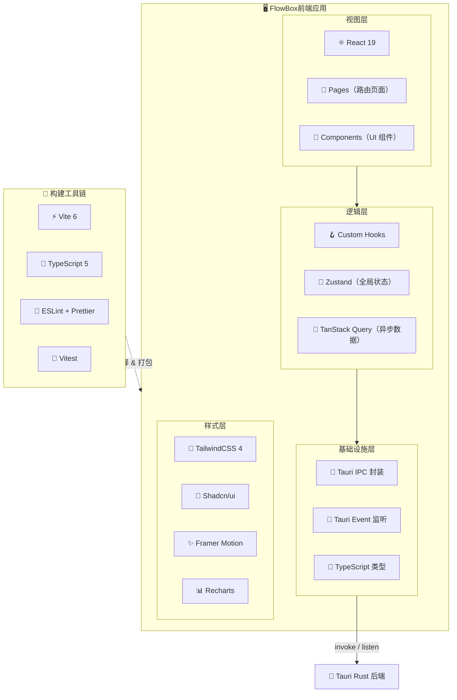

# 🎨 FlowBox桌面端 — 前端架构文档

> 项目代号：FlowBox | 产品名：FlowBox桌面端
>
> 本文档定义前端层的技术架构、设计规范和工程标准，与 [系统架构文档](./ARCHITECTURE.md) 配套使用。

---

## 目录

- [一、前端技术栈总览](#一前端技术栈总览)
- [二、工程化规范](#二工程化规范)
- [三、设计系统](#三设计系统)
- [四、核心通信层](#四核心通信层)
- [五、状态管理架构](#五状态管理架构)
- [六、页面与模块设计](#六页面与模块设计)
- [七、性能优化方案](#七性能优化方案)
- [八、多窗口与特殊 UI](#八多窗口与特殊-ui)
- [九、测试策略](#九测试策略)
- [十、国际化与无障碍](#十国际化与无障碍)

---

## 一、前端技术栈总览

### 1.1 技术栈全景图



### 1.2 核心依赖清单

#### 框架与运行时

| 依赖 | 版本 | 职责 | 选型理由 |
|------|------|------|----------|
| **React** | 19.x | UI 渲染引擎 | Concurrent Mode + Server Components 就绪，生态最成熟 |
| **TypeScript** | 5.x | 类型系统 | 编译期类型安全，IDE 智能提示，重构可靠性 |
| **Vite** | 6.x | 开发服务器 & 打包 | HMR < 50ms，Tauri 官方推荐，ESM 原生支持 |
| **@tauri-apps/api** | 2.x | 前端 Tauri 绑定 | IPC invoke、Event listen、系统 API 桥接 |

#### UI 与样式

| 依赖 | 职责 | 选型理由 |
|------|------|----------|
| **TailwindCSS 4** | 原子化 CSS | 零运行时、JIT 按需生成、暗色模式 `dark:` 开箱支持 |
| **Shadcn/ui** | 组件库 | 非黑盒——源码直接复制到项目中，可深度定制，基于 Radix 无障碍原语 |
| **Framer Motion** | 动画引擎 | 声明式 API、layout 动画自动过渡、手势支持 |
| **Recharts** | 数据可视化 | React 原生图表库，API 简洁，满足专注统计和时间分析需求 |
| **Lucide React** | 图标库 | 与 Shadcn/ui 配套，ISC 协议，800+ 图标按需引入 |

#### 状态与数据

| 依赖 | 职责 | 选型理由 |
|------|------|----------|
| **Zustand** | 全局状态管理 | API 极简（无 Provider 包裹）、体积 < 1KB、中间件灵活 |
| **TanStack Query** | 异步状态管理 | 自动缓存 / 去重 / 后台刷新 / 乐观更新，完美适配 IPC 调用 |
| **React Router** | 路由管理 | 嵌套路由 + Layout 路由，Tauri 单窗口 SPA 标准方案 |

#### 开发工具

| 依赖 | 职责 | 选型理由 |
|------|------|----------|
| **ESLint** | 代码检查 | 规范统一，搭配 `eslint-plugin-react-hooks` 防止 Hook 误用 |
| **Prettier** | 代码格式化 | 零争论风格统一，与 ESLint 互补 |
| **Vitest** | 单元测试 | 与 Vite 同引擎，HMR 级测试速度，Jest 兼容 API |
| **@testing-library/react** | 组件测试 | 面向用户行为测试，不测实现细节 |

### 1.3 技术选型决策记录

| 决策点 | 选择 | 否决方案 | 理由 |
|--------|------|----------|------|
| CSS 方案 | TailwindCSS | CSS Modules / Styled Components | 原子化开发效率最高，设计 Token 通过 `theme` 统一管理，无运行时开销 |
| 组件库 | Shadcn/ui | Ant Design / MUI | Ant Design 风格偏后台管理，MUI 包体过大；Shadcn 可复制源码深度定制 |
| 状态管理 | Zustand + TanStack Query | Redux Toolkit / Jotai | Redux boilerplate 过多；Zustand 极简 + TanStack Query 管异步 = 最佳组合 |
| 动画库 | Framer Motion | React Spring / CSS Transition | API 最声明式，layout 动画零配置，社区最活跃 |
| 图表库 | Recharts | ECharts / D3.js | ECharts 包体 ~1MB 过重，D3 学习曲线陡；Recharts 轻量且 React 原生 |
| 包管理器 | pnpm | npm / yarn | 磁盘占用最小（硬链接），安装速度快，`workspace` 支持好 |

### 1.4 版本兼容性矩阵

| 运行环境 | 最低版本 | 说明 |
|----------|----------|------|
| **macOS** | 11.0 (Big Sur) | Tauri 2.0 WKWebView 最低要求 |
| **WebView** | Safari 14+ (macOS 内置) | 支持 ES2020、CSS Grid、`IntersectionObserver` |
| **Node.js** | 22.x LTS | 开发环境构建工具链 |
| **Rust** | 1.77+ | Tauri 2.0 MSRV |

> ⚠️ **重要**：Tauri 使用系统 WebView 而非 Chromium，macOS 上为 WKWebView（Safari 内核）。需注意：
> - 不可使用 Chrome-only API（如 `chrome.runtime`）
> - CSS 需兼顾 `-webkit-` 前缀
> - `SharedArrayBuffer` 默认不可用（不影响本项目）

### 1.5 依赖管理策略

| 规则 | 说明 |
|------|------|
| **锁版本** | `pnpm-lock.yaml` 必须提交，CI 使用 `--frozen-lockfile` |
| **定期更新** | 每两周运行 `pnpm outdated`，评估安全补丁和功能更新 |
| **安全审计** | CI 中 `pnpm audit --audit-level=high`，高危漏洞阻断构建 |
| **最小依赖** | 引入新依赖需评估：包体影响、维护活跃度、是否可自行实现 |
| **类型要求** | 所有依赖必须有 TypeScript 类型定义（内置或 `@types/*`） |

---

## 二、工程化规范

### 2.1 目录结构

```
src/
├── main.tsx                        # React 挂载入口
├── App.tsx                         # 根组件（路由 + 全局 Provider）
│
├── pages/                          # 📄 路由页面（每个文件 = 一条路由）
│   ├── TodoPage.tsx                # /todo
│   ├── IdeaPage.tsx                # /idea
│   ├── PomodoroPage.tsx            # /pomodoro
│   ├── ClipboardPage.tsx           # /clipboard
│   ├── VoicePage.tsx               # /voice
│   ├── StatsPage.tsx               # /stats
│   └── SettingsPage.tsx            # /settings
│
├── components/                     # 🧩 可复用组件
│   ├── ui/                         # Shadcn/ui 基础组件（Button, Dialog, Input...）
│   ├── layout/                     # 布局组件
│   │   ├── AppShell.tsx            # 主布局外壳（侧栏 + 内容区）
│   │   ├── Sidebar.tsx             # 侧边导航栏
│   │   └── TitleBar.tsx            # 自定义标题栏（Tauri 无边框窗口）
│   └── shared/                     # 业务通用组件
│       ├── TagSelect.tsx           # 标签选择器
│       ├── AiResultCard.tsx        # AI 结果展示卡片
│       ├── EmptyState.tsx          # 空状态占位
│       └── ConfirmDialog.tsx       # 确认弹窗
│
├── hooks/                          # 🪝 自定义 Hook
│   ├── useInvoke.ts                # Tauri IPC 封装
│   ├── useTauriEvent.ts            # Tauri Event 监听
│   ├── useTodo.ts                  # Todo CRUD Hook
│   ├── useIdea.ts                  # Idea CRUD Hook
│   ├── usePomodoro.ts              # 番茄钟控制 Hook
│   ├── useClipboard.ts             # 剪贴板数据 Hook
│   ├── useVoice.ts                 # 语音录制 Hook
│   ├── useAi.ts                    # AI 调用 Hook
│   └── useSettings.ts             # 设置读写 Hook
│
├── stores/                         # 🐻 Zustand 全局状态
│   ├── pomodoroStore.ts            # 番茄钟运行态
│   ├── settingsStore.ts            # 用户偏好设置
│   └── butlerStore.ts              # 全局管家对话状态
│
├── lib/                            # 🔧 工具函数
│   ├── invoke.ts                   # invokeCommand<T> 统一封装
│   ├── errors.ts                   # AppCommandError 错误类
│   ├── constants.ts                # 全局常量
│   ├── date.ts                     # 日期格式化工具
│   └── cn.ts                       # clsx + twMerge 样式合并
│
├── types/                          # 📝 TypeScript 类型定义
│   ├── todo.ts                     # Todo 相关类型
│   ├── idea.ts                     # Idea 相关类型
│   ├── pomodoro.ts                 # 番茄钟相关类型
│   ├── clipboard.ts                # 剪贴板相关类型
│   ├── voice.ts                    # 语音相关类型
│   ├── ai.ts                       # AI 相关类型
│   ├── settings.ts                 # 设置相关类型
│   └── common.ts                   # ApiResponse 等通用类型
│
└── styles/                         # 🎨 全局样式
    └── globals.css                 # Tailwind 指令 + CSS 变量
```

#### 目录职责边界

| 目录 | 可以做什么 | 不应做什么 |
|------|-----------|-----------|
| `pages/` | 组合组件、接入 Hook、处理路由参数 | 不写业务逻辑、不直接调用 invoke |
| `components/ui/` | 纯 UI 渲染、接收 props | 不调用 Hook、不感知业务 |
| `components/shared/` | 复用的业务组件 | 不直接调 invoke，通过 props 或 Hook |
| `hooks/` | 封装 IPC 调用、管理异步状态 | 不渲染 UI |
| `stores/` | 管理全局非异步状态 | 不直接调 invoke（交给 Hook 层） |
| `lib/` | 纯函数、无副作用的工具 | 不依赖 React、不调用 Hooks |
| `types/` | 类型定义、接口声明 | 不含运行时代码 |

### 2.2 命名规范

#### 文件命名

| 类别 | 规范 | 示例 |
|------|------|------|
| 页面组件 | `PascalCase` + `Page` 后缀 | `TodoPage.tsx` |
| UI 组件 | `PascalCase` | `Button.tsx`、`TagSelect.tsx` |
| Hook | `camelCase` + `use` 前缀 | `useTodo.ts`、`useInvoke.ts` |
| Store | `camelCase` + `Store` 后缀 | `pomodoroStore.ts` |
| 工具函数 | `camelCase` | `date.ts`、`cn.ts` |
| 类型文件 | `camelCase` | `todo.ts`、`common.ts` |
| 常量 | 文件 `camelCase`，内部 `UPPER_SNAKE_CASE` | `constants.ts` 中 `DEFAULT_POMODORO_MINUTES` |

#### 代码命名

```typescript
// ✅ 组件 — PascalCase
export function TodoCard({ todo }: TodoCardProps) { ... }

// ✅ Hook — use 前缀 + camelCase
export function useTodoList(query?: TodoListQuery) { ... }

// ✅ 类型/接口 — PascalCase
interface CreateTodoPayload { ... }
type TodoStatus = 'pending' | 'in_progress' | 'done';

// ✅ 常量 — UPPER_SNAKE_CASE
export const DEFAULT_POMODORO_MINUTES = 25;
export const MAX_CLIPBOARD_HISTORY_DAYS = 30;

// ✅ 事件处理函数 — handle 前缀
const handleSubmit = () => { ... };
const handleDeleteTodo = (id: number) => { ... };

// ✅ 布尔变量 — is/has/should 前缀
const isLoading = true;
const hasError = false;
const shouldAutoStart = settings.autoStartPomodoro;
```

### 2.3 路由设计

```typescript
// App.tsx — 路由配置
import { createBrowserRouter, RouterProvider } from 'react-router-dom';

const router = createBrowserRouter([
  {
    path: '/',
    element: <AppShell />,              // 主布局（侧栏 + 内容区）
    children: [
      { index: true, element: <Navigate to="/todo" replace /> },
      { path: 'todo',      element: <TodoPage /> },
      { path: 'idea',      element: <IdeaPage /> },
      { path: 'pomodoro',  element: <PomodoroPage /> },
      { path: 'clipboard', element: <ClipboardPage /> },
      { path: 'voice',     element: <VoicePage /> },
      { path: 'stats',     element: <StatsPage /> },
      { path: 'settings',  element: <SettingsPage /> },
    ],
  },
]);

export default function App() {
  return (
    <QueryClientProvider client={queryClient}>
      <RouterProvider router={router} />
    </QueryClientProvider>
  );
}
```

#### 路由表

| 路径 | 页面 | 侧栏图标 | 说明 |
|------|------|----------|------|
| `/todo` | `TodoPage` | ✅ `CheckSquare` | 默认首页 |
| `/idea` | `IdeaPage` | 💡 `Lightbulb` | Idea 速记 |
| `/pomodoro` | `PomodoroPage` | 🍅 `Timer` | 番茄钟 |
| `/clipboard` | `ClipboardPage` | 📋 `Clipboard` | 剪贴板历史 |
| `/voice` | `VoicePage` | 🎙️ `Mic` | 语音记录 |
| `/stats` | `StatsPage` | 📊 `BarChart3` | 数据统计 |
| `/settings` | `SettingsPage` | ⚙️ `Settings` | 设置（底部固定） |

### 2.4 代码风格配置

#### ESLint 配置

```javascript
// eslint.config.js
import js from '@eslint/js';
import tseslint from 'typescript-eslint';
import react from 'eslint-plugin-react';
import reactHooks from 'eslint-plugin-react-hooks';

export default tseslint.config(
  js.configs.recommended,
  ...tseslint.configs.recommended,
  {
    plugins: { react, 'react-hooks': reactHooks },
    rules: {
      // TypeScript
      '@typescript-eslint/no-unused-vars': ['warn', { argsIgnorePattern: '^_' }],
      '@typescript-eslint/explicit-function-return-type': 'off',
      '@typescript-eslint/no-explicit-any': 'warn',

      // React
      'react/react-in-jsx-scope': 'off',
      'react-hooks/rules-of-hooks': 'error',
      'react-hooks/exhaustive-deps': 'warn',

      // 通用
      'no-console': ['warn', { allow: ['warn', 'error'] }],
      'prefer-const': 'error',
    },
  }
);
```

#### Prettier 配置

```json
// .prettierrc
{
  "semi": true,
  "singleQuote": true,
  "trailingComma": "all",
  "printWidth": 100,
  "tabWidth": 2,
  "bracketSpacing": true,
  "jsxSingleQuote": false,
  "arrowParens": "always"
}
```

#### TypeScript 关键配置

```json
// tsconfig.json 关键项
{
  "compilerOptions": {
    "target": "ES2020",
    "module": "ESNext",
    "moduleResolution": "bundler",
    "strict": true,
    "noUnusedLocals": true,
    "noUnusedParameters": true,
    "paths": {
      "@/*": ["./src/*"]              // 路径别名：@/components/...
    }
  }
}
```

### 2.5 Git 提交规范

#### Commit Message 格式

```
<type>(<scope>): <subject>

<body>
```

| type | 说明 | 示例 |
|------|------|------|
| `feat` | 新功能 | `feat(todo): add batch delete` |
| `fix` | Bug 修复 | `fix(pomodoro): timer drift after sleep` |
| `style` | 样式调整（不影响逻辑） | `style(sidebar): adjust nav item spacing` |
| `refactor` | 重构（不改变行为） | `refactor(hooks): extract useInvoke` |
| `perf` | 性能优化 | `perf(clipboard): virtualize list` |
| `test` | 测试相关 | `test(todo): add CRUD hook tests` |
| `docs` | 文档 | `docs: update frontend architecture` |
| `chore` | 构建/工具/依赖 | `chore: upgrade vite to 6.2` |

| scope | 对应模块 |
|-------|----------|
| `todo` | 待办管理 |
| `idea` | Idea 速记 |
| `pomodoro` | 番茄钟 |
| `clipboard` | 剪贴板 |
| `voice` | 语音记录 |
| `stats` | 数据统计 |
| `butler` | 全局管家 |
| `settings` | 设置中心 |
| `ui` | 通用 UI 组件 |
| `hooks` | 自定义 Hook |
| `ipc` | IPC 通信层 |

#### 分支策略

| 分支 | 用途 | 命名示例 |
|------|------|----------|
| `main` | 生产分支，始终可发布 | — |
| `develop` | 开发集成分支 | — |
| `feat/*` | 功能开发 | `feat/pomodoro-timer` |
| `fix/*` | Bug 修复 | `fix/clipboard-dedup` |
| `release/*` | 发布准备 | `release/v1.0.0` |

---

## 三、设计系统

本设计系统基于 **"The Digital Curator" (数字策展人)** 理念，摒弃传统工具的死板网格与线框，追求如现代画廊般高级、通透、且包含合理留白的沉浸桌面端体验。

### 3.1 核心设计哲学

- **无界体验 (The No-Line Rule)**：严禁使用 1px 的实线（如普通的 `border`）进行主要区块分割。空间与边界必须通过**背景色阶的自然推移**来定义，以降低视觉噪音。
- **物理隐喻 (Surface Hierarchy)**：将 UI 视作层叠的高级纸张或磨砂玻璃。底层空间为基底色（`surface`），越向上的交互层级颜色越明亮（或由于阴影显得不同）。
- **光影与材质 (Glass & Gradient)**：
  - **玻璃态 (Glassmorphism)**：所有悬浮层（全局管家悬浮窗、弹窗菜单、侧边导航栏）推荐使用半透明背景配合 `backdrop-blur`（12px~30px）。
  - **渐变灵魂**：主行为按钮 (Primary CTAs) 避免使用死板的纯色，而应应用极度微弱的 135° 线性渐变（如从 `primary` 过渡到 `primary-container`），赋予按钮不可被忽略的体量感。

### 3.2 颜色体系

颜色不仅是装饰，更是照明与指示层级的工具。本系统采用以 **Indigo (#4648d4)** 为核心的主色调。

| 颜色 Token | 角色 | 用途 |
|------------|------|------|
| `primary` | **Brand & Action** | 极少使用，仅用于主按钮、进度条环、激活状态的高亮指示。不可作为大面积背景。 |
| `surface` | **Canvas Base** | 最底层的画布底色，承载主要内容区。 |
| `surface-container-low` | **Recessed Area** | 用于侧边栏、输入框背景块，与主画布形成轻微色差分隔。 |
| `surface-container-highest`| **Elevated Area** | 悬浮卡片、弹窗菜单的底色，或列表项的 Hover 高亮背景。 |
| `on-surface` | **Primary Text** | 正文颜色，严禁使用干瘪的纯黑/纯白，应包含冷色倾向的极深蓝色以确保高级的灰度对比。 |
| `on-surface-variant` | **Muted Text** | 时间戳、次要说明、辅助性文本。 |
| `outline-variant` | **Ghost Border** | 当遇到无障碍要求（或聚焦选中状态）时，组合其 15-20% 的透明度作为「幽灵边框」或「光晕」。 |

### 3.3 字体排印 (Typography)

采用双字体策略，平衡"数字与科技感"和"连续阅读护眼度"。

| 层级 | 字体 | 尺寸 | 使用场景 |
|------|------|------|----------|
| **Display-LG** | **Manrope** | 3.5rem / 巨型 | 核心数据展示、空状态标语、番茄钟主刻度，体现独特的几何科技力量感。 |
| **Headline-SM**| **Manrope** | 1.5rem / 醒目 | 模块标题、页面顶栏大标题。 |
| **Body-MD** | **Inter** | 0.875rem / 标准 | 待办清单、笔记正文、历史记录，具备无懈可击的易读性。必须配合 1.5 倍行高。 |
| **Label-SM** | **Inter** | 0.6875rem / 迷你 | 标签芯片（Chips）、时间戳、图标伴随文字。 |

### 3.4 深度与悬浮 (Elevation & Depth)

深度的展现是基于光的三维映射，而非平面滤镜：

1. **色阶悬浮 (Tonal Layering)**：将高层级信息放在稍亮的 Surface Token 上，在没有一根线条的情况下自然形成视觉高低差。
2. **环境光阴影 (Ambient Shadows)**：对于绝对漂浮的元素（如 Option+Space 唤出的全局悬浮框），采用大范围模糊（如 32px）、极低透明度（6~8%）的深蓝色阴影 `rgba(19, 27, 46, 0.08)`，模拟在暗室中显示屏背光的漫反射。

### 3.5 核心视觉红线 (Do's and Don'ts)

- **✅ DO**：增加留白 (Whitespace)。当界面感到拥挤时，优先将间距拉大，而不是加网格线。
- **✅ DO**：善用不对称的设计。在大块留白中放入小型精致的内容以产生排版张力。
- **🚫 DON'T**：严禁使用干瘪的纯白 `#ffffff` 或纯黑 `#000000` 作为正文文字。
- **🚫 DON'T**：严禁使用高对比度及 100% 透明度的实线 Border 进行版式切分。
- **🚫 DON'T**：严禁使用毫无生气的系统默认投影参数。
